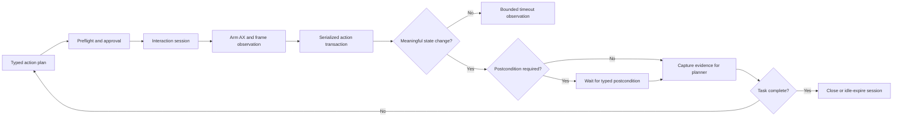

# Pace FastPath — the native computer-use runtime

Pace's computer-use advantage is not the speed of an isolated click. It is the
speed and reliability of the complete closed loop:

> understand intent → inspect state → act → confirm the new state → continue

Generic computer-use systems pay infrastructure tolls inside that loop. They
move screenshots and actions between a model client, an authenticated service,
and a remote desktop. They often rebuild capture or input machinery on every
step, then sleep for a fixed interval and hope the application finished.

Pace owns the whole loop on the user's Mac. ScreenCaptureKit, Accessibility,
Core Graphics, the planner, the action executor, and the observation logic can
share one local interaction session. That lets Pace optimize the seams rather
than treating the computer as a remote API.

This is the technical edge: **a native, semantic, state-synchronized action
runtime whose overhead stays small as tasks get longer.**

## Why the closed loop is the product

Computer-use latency compounds. A delay paid once at startup is usually
invisible; a delay paid after every action becomes the experience.

For a trajectory with several screen-dependent steps:

```text
total time = planning + screen capture + input dispatch + UI settling + observation
```

Model inference is only one term. Faster planners make the other terms more
visible, and longer tasks multiply them. A system can have fast generation and
still feel slow if it adds a fixed half-second after every action.

Pace's runtime should therefore optimize the trajectory, not benchmark one
primitive in isolation. The goal is not “click in one millisecond.” The goal is
“move from a safe decision to trustworthy evidence of the result with the
least avoidable delay.”

That distinction protects reliability. Acting faster without observing state
just produces mistakes faster.

## The six parts of the edge

### 1. The action plane is local

Pace's executor lives in the same process as the agent loop. It first uses the
macOS Accessibility tree to activate a semantic element and falls back to
Core Graphics input events only when the target application cannot expose a
usable AX action.

There is no computer-control network hop, action daemon, shell command, or
temporary process between Pace and the user's apps. Local mode also avoids a
remote screenshot transport. Privacy and speed come from the same architectural
choice: the user keeps the computer and the controller on one machine.

### 2. Semantic mutations beat simulated input

A coordinate click is weaker than pressing a known AX button. A thousand
synthetic key pairs are weaker than writing one AX value into a focused field.
Semantic operations are faster, survive layout movement, produce clearer
failure states, and can support undo.

Pace already follows this hierarchy:

1. Perform a semantic Accessibility action when the target supports it.
2. Use deterministic system APIs for Calendar, Reminders, Notes, Mail, media,
   and other structured tools.
3. Fall back to `CGEvent` input when the application exposes no better route.

The fallback remains important, but it is compatibility infrastructure rather
than the primary execution model.

### 3. Known work stays in one transaction

When the planner already knows a sequence, it emits the actions together in a
typed `payload.calls` envelope. Pace validates and approves the plan once, then
executes the ordered sequence locally. It does not ask the planner to rediscover
steps that are already known.

Re-planning is reserved for a real dependency: a later action needs information
that only exists after an earlier action changes the screen.

The completed runtime will treat each dependent sequence as a transaction:

- validate the entire sequence before the first mutation;
- serialize access to global keyboard, modifier, focus, and pointer state;
- preserve source order;
- return a typed result for every attempted action;
- stop before later dependent actions when one fails; and
- report the completed prefix and the unattempted suffix.

This makes batching a correctness boundary as well as a latency optimization.
A failed focus-changing click must never be followed by typing into whatever
field happened to be focused before it.

### 4. State changes replace guessed sleeps

The runtime observes the target application instead of assuming one universal
settling time.

Before dispatch, Pace captures a baseline and arms observation. After dispatch,
it waits for one of two local signals:

- an Accessibility notification describing a structural or focus change; or
- a new ScreenCaptureKit frame that differs meaningfully from the baseline.

The existing `PaceScreenImageDiffer` filters incidental pixel churn. A blinking
caret or clock tick should not advance a multi-step task. A changed button,
window, focused control, dialog, or content region should.

A changed frame answers only “is there new state worth inspecting?” It does not
prove that Save, download, rendering, or navigation finished. When a later
mutation depends on completion, the action supplies a stronger postcondition:
an expected AX element, a missing spinner, a confirmation label, a new window,
a file on disk, or another tool-specific condition.

Every wait is bounded. Timeout becomes an explicit observation for the planner,
never an infinite stall or a silent assumption of success.

### 5. Interaction-scoped resources stay warm

Pace pays setup at the narrowest safe lifetime.

A screen-action turn creates an interaction session. That session can own:

- the current display and window filters;
- a lazy ScreenCaptureKit stream or one-shot capture fallback;
- the baseline and most recent meaningful frame;
- the serialized input transaction queue;
- per-action and per-observation timing; and
- short-lived tool connections that are worth reusing.

The session survives across the dependent steps of one task and tears down
after completion or a short idle timeout. It is not an app-lifetime recorder.
That boundary preserves Pace's battery, thermal, privacy, and TCC posture while
removing repeated setup from the hot loop.

Pace's own overlay windows remain excluded from capture. Otherwise cursor and
HUD animations would wake the observer and masquerade as progress in the target
application.

### 6. Pace measures action-to-evidence

The primary runtime metric is the time between dispatching an approved action
and obtaining trustworthy evidence for the next decision.

Pace measures at least:

- capture setup and encoding;
- semantic AX dispatch;
- CGEvent construction, posting, hover, and hold time;
- action-to-first-meaningful-change;
- action-to-required-postcondition;
- time spent in compatibility delays;
- per-action and per-transaction failures;
- five- and eight-step trajectory overhead; and
- cold versus reused MCP initialization.

Reports include warm p50 and p95, the Mac model, macOS version, display layout,
target app, action type, and whether Pace's overlays were visible. The product
claim comes from the native end-to-end trajectory, not a synthetic provider
comparison.

## Runtime architecture



The interaction session is the ownership boundary. Capture, input sequencing,
observation, and timing belong together because they describe one changing
desktop state. The planner receives typed evidence from that boundary rather
than coordinating low-level timing itself.

## What Pace already owns

The runtime is not starting from a blank page. Pace already ships the difficult
native substrate:

| Capability | Current Pace implementation |
| --- | --- |
| Local input dispatch | Long-lived `PaceActionExecutor` using AX first, then `CGEvent` |
| Typed action sequences | `PaceActionExecutionPlan` and structured `payload.calls` |
| Up-front safety | Tool registry, risk policy, preflight, approval, and audit log |
| Semantic long-text edit | AX `set_value` with mutation history for undo |
| Visual change classification | `PaceScreenImageDiffer` and screen-context cache |
| Multi-step re-grounding | Bounded plan-act-observe loop with a fresh screenshot |
| FastPath observation v1 | Shared bounded waiter checks lightweight AX focus/window state immediately, then at 25 ms for clicks or 40 ms for agent steps; cancellation is typed and the previous 200/600 ms bounds remain fallbacks |
| Screen capture | ScreenCaptureKit with multi-display support and own-window exclusion |
| Coarse latency accounting | Per-turn STT, VLM, planner, tool, and TTS budget |

FastPath observation v1 is implemented in the active
`pace-fastpath-observation` OpenSpec change and covered by focused unit tests.
It is not release-claimed until the real-hardware action smoke is complete. The
remaining work expands that first state-driven slice into the complete runtime:

| Runtime gap | Edge created when closed |
| --- | --- |
| AX-invisible pixel changes retain the 200/600 ms fallback | Wake the same observation contract from meaningful ScreenCaptureKit frames |
| One-shot capture discovery on each step | Reuse capture state during the active task when measurements justify it |
| Prose-based action success/failure | Typed outcomes and fail-fast dependent transactions |
| Main-actor serialization across yielding waits | Explicit atomic ownership of input state |
| Eight-millisecond-per-grapheme compatibility typing | Constant-shape AX writes with a faster non-clipboard fallback |
| MCP process and initialization per call | Optional bounded reuse for measured repeated-call workloads |
| Coarse tool timing | Per-action action-to-evidence p50/p95 |

This table is the implementation truth: the native foundation and AX-first
adaptive settling exist; frame-driven observation, transactional input, and
session ownership complete the edge.

## How Pace gets there

### Phase 1 — make the native loop measurable (next)

Add behavior-neutral timing around capture, every action dispatch, compatibility
delay, first meaningful change, postcondition, and transaction completion.
Action audit entries record real durations instead of zero. Add a local
benchmark harness for a single screenshot, AX click, CGEvent click, 100- and
1,000-character edits, a four-action transaction, five- and eight-step loops,
and repeated MCP calls.

This produces the baseline and prevents an attractive microbenchmark from
making the full trajectory worse.

### Phase 2 — introduce one action-to-observation waiter (implemented locally)

`PaceActionObservationWaiter` now compares injected equatable state immediately
and at a bounded cadence, returning typed changed, timed-out, or cancelled
outcomes. Runtime callers use a lightweight AX snapshot so polling does not
repeat the existing up-to-600-node tree walk.

Both the legacy loop's fixed 600 ms settle and click verification's fixed 200 ms
check now route through this contract. Clicks retain one full AX-tree comparison
at timeout, preserving the previous ability to recognize controls that mutate
without changing focus. The conservative maximum waits are unchanged; the win
comes from returning early when lightweight AX evidence arrives.

### Phase 3 — make action sequences transactional

Replace observation-string failure inference with typed outcomes. Stop a
dependent sequence on failure, preserve completed-prefix evidence, and mark the
rest unattempted. Add an executor-owned queue or lock that holds keyboard and
pointer ownership through atomic sequences even when async work yields the main
actor.

Tests cover modifier release, mouse-down/mouse-up pairing, cancellation, partial
failure, user interruption, and the guarantee that no later mutation runs after
a required predecessor fails.

### Phase 4 — keep capture warm for the interaction

Prototype a lazy `SCStream` owned by the interaction session. Reuse its filters
and frames across dependent steps, handle display changes, and tear it down on
completion or idle expiry. Keep the one-shot screenshot path as the fallback.

Adopt the stream only if the full-loop benchmark improves without unacceptable
energy, memory, thermal, TCC, or own-overlay false-positive costs. Persistence
is a means, not the goal.

### Phase 5 — finish semantic text and tool-session reuse

Make large text reliably prefer AX mutation. For AX-hostile applications,
benchmark chunked Unicode CGEvents while preserving the ban on pasteboard-based
typing.

Separately measure MCP startup and handshake time. Where repeated calls to the
same server are materially slower cold, add an idle-expiring session with
serialized request IDs, crash detection, configuration/secret invalidation,
explicit shutdown, and no automatic replay of a possibly delivered mutation.

Longer-lived third-party processes and secrets are a security cost. MCP reuse
ships only when its measured trajectory win pays for that larger lifetime.

## Acceptance gates

FastPath v1 is implemented when:

- eligible multi-step actions no longer pay the fixed 600 ms settle;
- click verification and loop settling use the same observation contract;
- unchanged or AX-invisible applications retain the previous maximum waits;
- cancellation stops observation and later candidate attempts; and
- the focused waiter and executor suites pass through isolated DerivedData.

The complete FastPath runtime additionally requires:

- no dependent action runs after a required predecessor fails;
- input transactions cannot interleave pointer or modifier state;
- large AX-supported edits do not scale with the number of synthesized keys;
- Pace's own overlays cannot satisfy target-application change detection;
- capture sessions terminate after the interaction and survive display changes;
- the representative five- and eight-step corpus improves p50 and p95 without a
  task-success regression; and
- every published latency number is reproducible on named Mac hardware.

The release gate remains real-hardware execution. Unit tests can validate state
machines, transaction semantics, cancellation, and diff policy, but they cannot
prove ScreenCaptureKit timing, Accessibility behavior, application repainting,
or TCC boundaries.

## Why this is defensible

The edge is not a single private algorithm. It is the integration of several
macOS-native advantages behind one contract:

- semantic Accessibility actions before coordinate input;
- local observation without screen transport;
- state-driven continuation rather than fixed sleeps;
- transaction semantics for global input state;
- interaction-scoped resource reuse;
- application-specific readiness where pixels are insufficient; and
- measurements of the entire action-to-evidence trajectory.

A generic remote computer API cannot easily provide those guarantees because
the important seams belong to different products: model client, network,
desktop service, capture stack, input stack, and target application. Pace owns
the seams on the Mac. FastPath turns that ownership into a runtime that feels
immediate on short commands and does not accumulate avoidable delay or unsafe
assumptions on long ones.
