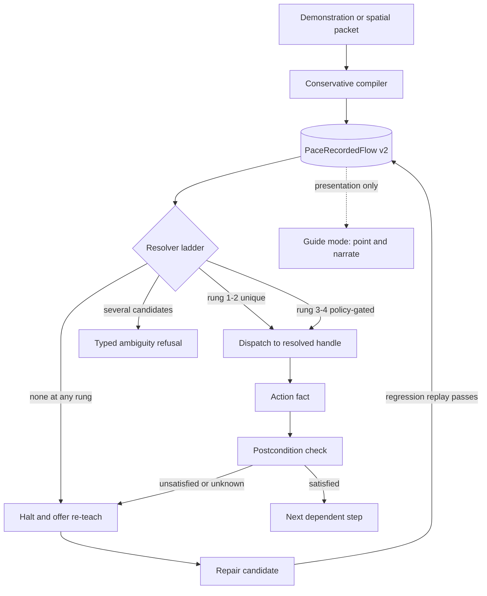

## Context

See [proposal.md](./proposal.md) for motivation. The behavior contracts are split
across three capability specs:
[deterministic-flow-execution](./specs/deterministic-flow-execution/spec.md),
[spatial-context-capture](./specs/spatial-context-capture/spec.md), and
[evidence-rich-recorded-flows](./specs/evidence-rich-recorded-flows/spec.md).

Pace already owns the substrate: push-to-talk, ScreenCaptureKit capture, AX and
OCR and local-VLM context, a non-activating annotation/cursor overlay, action
approval, observation, undo, audit, and recorded flows with a replay planner.

What it does not own is a *provable* link between the element a user meant and
the element a later replay touches. Today `PaceAXPressResolution` carries one
`String` (`debugLabel`) chosen so the struct can stay `Equatable` for tests. The
live `AXUIElement` is discarded at the test boundary, so
`PaceFlowReplayer.performAXPress` recovers a target by reading the current
pointer with `CGEvent(source: nil)?.location` and calling
`PaceAXTargeter.tryClickViaAccessibility(atGlobalCGPoint:)`. The in-code comment
justifies this as "close enough" because the recorder captured the user's click
point and the replayer brings the app forward first. Neither assumption holds
during an unattended replay, and no amount of richer recorded evidence can help
while dispatch still reads the pointer.

Every downstream ambition in issue #157 depends on closing that gap, which is
why it is slice 1 and why it is worth shipping alone.

## Goals / Non-Goals

**Goals:**

- Make a replayed action provably act on the resolved target or refuse.
- Give a recorded step enough redundant, bounded evidence to survive theme
  changes, moved controls, and safe label drift.
- Make ambiguity, missing permission, occlusion, and unverifiable results halt
  before any later dependent action.
- Let a user narrow intent spatially ("this", "there") with one bounded,
  interaction-scoped, on-device packet.
- Keep the healthy replay path free of any planner or VLM call.
- Keep every slice verifiable through `bash scripts/test-pace.sh` with injected
  seams, not by driving the live desktop.

**Non-Goals:**

- Executing "move this there" as a drag in v1 (see ambiguity A11).
- Background or unfocused input through private SkyLight/AX SPI.
- Any cloud LLM, STT, or VLM path, including TipTour's Gemini/Worker shape.
- An MCP/HTTP screen-serving server, or any external context export.
- A bundled UI-element detector derived from third-party weights.
- Generalizing several demonstrations into one autonomous skill.
- Persisting raw screen history.
- A Python or Rust daemon, or any new production dependency.

## Decisions

### Split the resolution result from the execution handle

`PaceAXPressResolution` keeps its `Equatable` `debugLabel` and gains a
non-`Equatable`, test-inconstructible execution handle that production fills
with the live element and tests leave empty. Equality continues to compare only
the marker, so existing replayer tests keep working unchanged.

Dispatch then has exactly two outcomes: press the carried handle, or refuse.
There is no third "re-resolve from somewhere else" path, because that path is
the defect. A resolution without a handle is a refusal, not a fallback to the
cursor. This is deliberately stricter than the current behavior and may surface
existing flows that only ever worked by accident; slice 1's fixture corpus has
to say how many.

Alternatives considered: making `AXUIElement` `Equatable` and comparing it
directly (leaks a live UI reference into test code and makes fixtures
machine-specific); passing an index into a resolver-owned table (equivalent, but
adds lifetime management for no additional safety); resolving inside the
dispatcher instead of the tree source (moves the same problem one layer down and
loses the injectable seam that makes replay testable at all).

### Use a strict ladder where "several" refuses and only "none" descends

The five rungs are:

1. exact AX identifier/handle inside the exact recorded PID and `CGWindowID`;
2. unique AX role/name/ancestor match inside that same window;
3. local crop/template plus OCR/landmark evidence;
4. optional on-device VLM grounding, only when the step's policy allows it;
5. halt and ask the user to re-teach.

Descent happens only when a rung produces **zero** candidates. A rung producing
two or more equally eligible candidates returns a typed ambiguity refusal and
the ladder stops there. This is the strict reading of "ambiguity is a refusal,
not permission to fall through to a weaker rung"; the issue does not distinguish
the two failure shapes, so this proposal states the reading explicitly rather
than letting the implementation pick one silently (ambiguity A3).

"Healthy replay" is defined as resolution at rung 1 or rung 2. That definition is
what makes "zero planner/VLM calls on healthy replay" and "rung 4 exists"
compatible; the issue asserts both without reconciling them (ambiguity A4).

### Make the action fact and the postcondition two separate typed values

An action fact records what Pace did and how it knows: `confirmed`, `partial`,
`unverifiable`, `suspectedNoop`, `refused`, plus the rung used and the evidence
that justified it. A postcondition records whether the world reached the
recorded expectation: `satisfied`, `unsatisfied`, `unknown`.

Only `satisfied` advances a dependent consequential step. A `confirmed` action
fact with an `unknown` postcondition halts a dependent step — the two values are
never collapsed, and a successful dispatch is never read as a successful result.
On halt, the completed prefix is preserved and the suffix is left unattempted;
there is no partial rollback and no best-effort continuation.

Postconditions are bounded and structural (an AX attribute reaching a value, a
window/sheet appearing or closing, a focused element changing). They do not run
model inference and cannot read arbitrary process state.

### Keep v1 flow JSON byte-compatible and treat v2 as an in-memory upgrade

`PaceRecordedStep`'s existing cases stay decodable exactly as written. A v1 file
with no `schemaVersion` key is read as implicit version 1 and upgraded in memory
into a v2 value whose evidence fields are empty and whose risk class is derived
from the existing `PaceFlowReplayPlanner` pause-before-send heuristic. An empty
evidence set resolves at rung 1/2 only and never reaches rung 3, so a migrated
v1 flow behaves exactly as it does today.

Whether a v1 file is ever *rewritten* as v2 is an owner decision (D5). The
issue asks for both "migrate without breaking the current JSON representation"
and "schema version and integrity digest" on every step, which cannot both hold
for an untouched v1 file (ambiguity A1). The default assumed here is the
conservative one: v1 files are never rewritten in place, and v2 is written only
for newly recorded or explicitly re-taught flows.

The integrity digest covers the serialized step list and its evidence, and
exists to detect corruption and out-of-band editing. It is not a security
boundary — the file lives in the user's own Application Support directory.

### Bound the spatial packet by the interaction, not by a session

`PaceSpatialContextPacket` is a pure versioned value created on chord release
and dropped when the interaction it serves ends. It carries a packet/session id
and timestamp; the display id and an explicit coordinate-space tag for every
geometric field; a sampled and capped polyline plus a bounding region; up to two
named regions (`this`, `there`); the hovered window's PID, `CGWindowID`, bundle
id, app name, title, and frame; the intersected/focused AX element's identifier,
role, subrole, label/title/description, value *shape* (not value), frame, and an
ancestor fingerprint; selected text when the field is not secure; a tight crop
plus local Vision OCR text; the local transcript or typed instruction; and a
provenance/privacy flag per field.

Every coordinate field names its space. AppKit `NSScreen` geometry is
origin-bottom-left, Core Graphics and AX are origin-top-left, and displays left
of or above the main display have negative origins. A packet that cannot state
which space a value is in is invalid, not "probably main-display".

Pace's own overlays are excluded from capture. A full-window screenshot is never
persisted merely because a packet exists.

### Treat "ephemeral" as a retention rule with one definition

"Ephemeral" means: held in memory for the interaction, never written to disk,
and released when the packet is released. "Persisted" means: written to
Application Support as approved flow evidence. A crop is derived from an
ephemeral capture and may become persisted evidence only through explicit
approval; the source capture never does. The issue uses "ephemeral" for both
"never written" and "written then deleted" (ambiguity A5); this change uses only
the first sense, and there is no delete-later path.

### State the secure-text guarantee as what macOS can actually tell us

Secure exclusion is enforced at three points: system secure input mode
(`IsSecureEventInputEnabled`) suppresses capture entirely; an AX role of
`AXSecureTextField` or a secure-marked ancestor excludes value and selected-text
evidence; and typed text recorded while either condition held is stored as a
redacted placeholder, never as characters.

Pace cannot detect a password field a host application does not mark — a custom
canvas control, or in some cases a web input inside a browser's rendered
content. The unqualified acceptance criterion "secure text is never captured or
serialized" is therefore not implementable as literally written (ambiguity A6).
The spec states the achievable guarantee and requires the capture surface to
refuse rather than guess when secure status is unknown for a text-bearing field.

### Compile conservatively and refuse partial output

Compilation drops incidental input (focus-only clicks, no-op modifier presses),
groups consecutive keystrokes into one typing step, suppresses anything captured
under secure conditions, and infers a parameter only for a literal value that
appears verbatim in the transcript. If any step cannot be compiled with at least
rung-2-viable evidence, the whole compilation is refused. A partially compiled
flow is worse than none, because it looks reusable and is not.

### Make repair a candidate, never an edit

Drift produces a repair candidate: the halted step, what Pace expected, what it
found, and a proposed replacement built from a fresh spatial packet the user
supplies by re-pointing. The candidate is a separate reviewable object. It is
promoted into the active flow only after a deterministic regression replay of
the whole flow succeeds. Nothing about the active flow changes before promotion,
and a rejected candidate leaves no trace in it.

### Make Guide mode presentation, not a second format

Guide mode walks the same compiled v2 flow, resolves each step through the same
ladder, and instead of dispatching, points with the existing cursor/annotation
overlay and narrates. It shares the resolver so a step Guide mode cannot point
at is exactly a step replay would refuse. It never posts input.

### Verify through injected seams, never terminal xcodebuild

`scripts/test-pace.sh` documents that terminal `xcodebuild` can invalidate the
interactive app's TCC grants. Every slice's core claim must be provable through
that script with injected AX tree sources, fixed packets, synthetic window
inventories, recorded coordinate spaces, and fake displays. Anything provable
only by driving the live desktop is dogfood evidence, not acceptance evidence,
and must be recorded as such in `tasks.md` the way earlier changes did.

## Slice plan

Each slice states what ships, what proves it, and what would make continuing a
mistake. "Stop if" is a decision point that returns to the owner, not a silent
fallback.

### Slice 1 — Resolved-target dispatch

**Ships:** the execution handle on `PaceAXPressResolution`, a `performAXPress`
that presses the carried handle, and a refusal when no handle is present. No
schema change, no new user surface.

**Proves it:** fixture replays asserting the pressed element is the resolved one
while the synthetic pointer sits over a different element; a refusal fixture for
a handle-less resolution; the existing replayer tests still green.

**Stop if:** the live element cannot be carried across the `PaceAXTreeSource`
seam without making test fixtures machine-specific, or pressing the resolved
element regresses flows that today only succeed because the pointer happened to
be correct. Either result means the flow runtime needs restructuring before any
of slices 2-8 is worth starting.

### Slice 2 — Typed outcomes and ambiguity refusal

**Ships:** action-fact and postcondition types, rungs 1-2 with the strict
"several refuses" rule, window-scoped resolution against exact PID plus
`CGWindowID`, prefix-preserving halt, and the first fixture classes (two windows
from one PID, two same-label siblings, missing permission, user cancellation).

**Proves it:** fixtures for each halt class asserting no later dependent step was
attempted, and that a `confirmed` fact with `unknown` postcondition still halts.

**Stop if:** exact `(pid, CGWindowID)` targeting cannot be established from
public APIs reliably enough that ordinary single-window apps stop resolving —
i.e. if the strict rule produces unnecessary halts on the common case, the
ladder's premise is wrong and the remaining slices inherit the problem.

### Slice 3 — Flow v2 schema and migration

**Ships:** the versioned v2 value, implicit-v1 upgrade on load, risk class,
bounded pre/postcondition fields, provenance, model-fallback policy, and the
integrity digest. Evidence fields exist and are empty.

**Proves it:** Codable round trips; byte-identical re-serialization of untouched
v1 files; a replay-parity fixture showing migrated v1 flows behave as before.

**Stop if:** v1 parity cannot be shown without rewriting v1 files. That is
decision D5 escalating, not an implementation detail to resolve locally.

### Slice 4 — Spatial capture packet and highlight chord

**Ships:** the listen-only event tap, the overlay trail, the packet, `this` and
`there` regions, window binding, AX/selected-text preference, secure exclusion,
ephemeral capture with tight crops, and the read-only requests ("what is this?",
"click this") routed through the existing approval path.

**Proves it:** packet fixtures across synthetic multi-monitor layouts with mixed
backing scale factors and negative origins; secure-field refusal fixtures;
overlay-exclusion assertions; a tap-disabled detection fixture.

**Stop if:** any of these hold — the event tap cannot be observed reliably while
system secure input mode is active *and* the packet cannot tell that it is being
suppressed; crop-to-AX-frame round trip exceeds tolerance on mixed-scale
multi-monitor setups; or a disabled/timed-out tap cannot be detected and
surfaced. A highlight chord that silently does nothing is worse than no chord.

### Slice 5 — Evidence-rich compilation and rungs 3-5

**Ships:** the recorder writing v2 evidence, the conservative compiler with
refusal-on-partial, rung 3 (crop/template plus OCR landmarks), optional
policy-gated rung 4, and rung 5 halt-and-re-teach. Adds the drift fixture classes
(moved control, renamed control, theme drift, AX-sparse canvas, stale
screenshot, occlusion, surprise modal).

**Proves it:** drift fixtures succeeding through retained evidence where the
issue says they should, and halting where it says they should, with the rung
used asserted per fixture.

**Stop if:** rung 3 cannot beat a coin flip on the drift fixtures, or rung 4
cannot be strictly gated off the healthy path. In the second case, drop rung 4
and ship a four-rung ladder rather than let a VLM call leak into healthy replay.

### Slice 6 — Repair candidates and promotion

**Ships:** the drift surface, re-pointing into a repair candidate, deterministic
regression replay, and explicit promotion.

**Proves it:** fixtures showing the active flow unchanged before promotion,
unchanged after rejection, and updated only after a passing regression replay.

**Stop if:** a regression replay cannot be made deterministic without recording
and re-driving live application state — a non-deterministic promotion gate
approves bad repairs and is worse than requiring a re-teach.

### Slice 7 — Guide mode

**Ships:** point-and-narrate presentation over the compiled flow, sharing the
resolver, posting no input.

**Proves it:** a fixture asserting zero input events are posted for a full guided
run, and that an unresolvable step is presented as unresolvable rather than
skipped.

**Stop if:** nothing structural; this slice is small and independent. It is the
easiest one to drop for scope, not for risk.

### Slice 8 — Evaluation matrix and gate

**Ships:** the eight metrics (correct completion, silent incorrect completion,
safe halt, unnecessary halt, resolution rung used, action-to-evidence latency,
planner/VLM calls on healthy replay, peak memory and retained artifact size)
reported over the accumulated fixture corpus, plus the thresholds that gate a
release.

**Proves it:** the matrix runs from `scripts/test-pace.sh` and fails on a
threshold breach.

**Stop if:** the owner has not set thresholds (D12). A matrix that reports
numbers nobody can fail is documentation, not a gate.

## Decisions reserved for the owner

None of these are resolved by this proposal.

- **D1 — Scope.** Approve the whole arc, approve slices 1-3 only, or drop
  everything past slice 1. Slice 1 is defensible on its own as a bug fix.
- **D2 — Chord.** Issue #157 offers Control+Shift as provisional. A held
  Control+Shift collides with common shortcuts in other apps. Owner picks the
  default and whether it is user-rebindable in v1.
- **D3 — Rung 4.** Does on-device VLM grounding ship in v1 at all, and if so is
  it default-off and per-step opt-in?
- **D4 — Crop retention.** Lifetime, location, encryption, and whether persisted
  crops are opt-in per flow or per step. The issue says "minimum approved crops"
  without defining the approval UX or a lifetime.
- **D5 — v2 write policy.** Never rewrite v1 files (this proposal's default),
  rewrite on next save, or one-time migrate. See ambiguity A1.
- **D6 — Surface status.** Is Spatial Teach Mode a shipping user feature in v1 or
  a flagged dogfood surface?
- **D7 — PRD status.** Does teach-by-demonstration move out of "Deferred" in
  [the teachable-skills PRD](../../../docs/product/prds/teachable-skills.md) when
  this proposal lands, or only when slice 5 lands? This change assumes the
  latter and annotates the PRD accordingly.
- **D8 — Auto-promotion.** May a repair candidate ever promote automatically
  after N clean regression replays, or is promotion always explicit?
- **D9 — Ambiguity margin.** Is "several candidates" always a refusal, or may a
  scoring margin break a tie at rung 2? This proposal assumes always-refuse.
- **D10 — Guide mode shape.** A distinct user-facing mode, or a per-run option on
  an existing flow?
- **D11 — Naming and layout.** `PaceSpatialContextPacket` as the issue proposes,
  and where new sources sit given the flat ~40-file `leanring-buddy/` layout.
- **D12 — Thresholds.** Peak memory ceiling, retained artifact size cap, and
  action-to-evidence latency budget. Without numbers, slice 8 cannot gate.
- **D13 — Existing flows.** Slice 1 makes some currently "working" replays refuse.
  Notify users, silently refuse, or offer re-teach on first refusal?

## Ambiguities in issue #157

Stated rather than resolved, because resolving them quietly would hide a real
scope decision.

- **A1 — Migration contradiction.** "Migrate v1 flows without breaking their
  current JSON representation" and "provenance, schema version, and integrity
  digest" on every step cannot both hold for an untouched v1 file. See D5.
- **A2 — The cursor fix is scoped to v2.** AC 7 says "a **v2** replay performs the
  resolved AX action on the resolved target". Read literally, v1 flows keep the
  cursor defect permanently. This proposal fixes dispatch for all flows in slice
  1, which is broader than the AC as written.
- **A3 — Ladder vs refusal.** "Fail-closed with five rungs" and "ambiguity is a
  refusal, not permission to fall through" only coexist if descent requires
  *zero* candidates. The issue never separates "no candidate" from "several".
- **A4 — Rung 4 vs the healthy-path metric.** A five-rung ladder including VLM
  grounding and a metric of "planner/VLM calls on healthy replay" are consistent
  only if rung 4 is by definition not healthy. The issue does not say so.
- **A5 — Two meanings of "ephemeral".** "Full screenshots remain ephemeral" reads
  as never-persisted, while "optional local crop as fallback evidence" requires
  persisting screenshot-derived data. One definition is needed.
- **A6 — Secure text is not always knowable.** "Secure text is never captured or
  serialized" is unachievable as an absolute; Pace can only honor what macOS and
  the host app mark as secure, plus system secure input mode.
- **A7 — "Silent incorrect completion" is a fixture-only metric.** It needs ground
  truth about the correct outcome, which live use cannot supply. It sits in a
  list otherwise readable as production telemetry.
- **A8 — "Teach/record this workflow" is not a spatial gesture.** It starts an
  open-ended session rather than naming a bounded region, so grouping it with
  "click this" under one chord conflates pointing with session control.
- **A9 — Matrix density.** Eight metrics across twelve-plus fixture classes is 96
  cells, and several are undefined ("resolution rung used" for a
  user-cancellation fixture). Which cells are required is unstated.
- **A10 — No thresholds.** Peak memory and retained artifact size are listed as
  things to measure with no limit attached, so they cannot fail anything.
- **A11 — "Move this there" is represented but not executable.** AC 3 requires only
  that `this` and `there` be *representable* as distinct regions, which is
  achievable. Section 2 lists "move this there" as a supported request, which
  implies a drag; no recorded step type or typed action currently expresses a
  drag, and no AC requires one. This proposal represents the two regions and does
  not execute a move.
- **A12 — "Bounded precondition and postcondition" is undefined.** The bound is
  not specified. This proposal reads it as structural AX/window checks with no
  model inference and no arbitrary process reads.

## Risks / Trade-offs

- **Slice 1 turns silent wrong presses into visible refusals** → some flows that
  appeared to work will stop. That is the correct outcome, but it is a
  user-visible regression and needs D13 answered before release.
- **Secure input mode can suppress the event tap** → the chord may be unobservable
  exactly where mistakes are most costly. The packet must be able to report
  suppression; if it cannot, slice 4 stops.
- **Mixed display scaling breaks crop-based evidence** → rung 3 is only as good as
  the point/pixel round trip. Measure the round-trip error before trusting rung
  3, and drop the rung rather than ship it weak.
- **Multi-monitor coordinate spaces are easy to get subtly wrong** → every
  geometric field names its space, and a space-less value is invalid. Fixtures
  include negative origins and a non-main primary display.
- **Permissions can be revoked or a tap silently disabled mid-session** → treat a
  disabled tap and a revoked grant as explicit halt states with user-visible
  reporting, never as an empty result.
- **Rung 4 could leak a VLM call into healthy replay** → rung 4 is reachable only
  after rungs 1-3 return zero candidates and only when the step policy allows it;
  the metric asserts zero calls on the healthy corpus.
- **Crop retention creates a new privacy surface Pace does not have today** →
  crops are opt-in, tightly bounded, excluded for secure content, and never a
  substitute for AX evidence. D4 must land before slice 5.
- **Eight slices invite abandonment mid-arc** → each slice is independently
  valuable and each has a stop condition, so a halt after any slice leaves the
  product coherent rather than half-migrated.
- **The evidence-rich schema grows persisted flow size** → cap evidence per step,
  cap crops per flow, and report retained artifact size as a gating metric.
- **Third-party licensing** → no OpenAdapt/CUA/TipTour code is copied, no
  Ultralytics-derived detector or weights are bundled, and Supamaus Lite
  contributes an interaction concept only. Any future detector needs a verified
  permissive model and data chain and must be benchmarked against the existing
  AX + OCR + set-of-mark path.

## Migration Plan

1. Land this proposal. Acceptance criterion 1 is then satisfied and issue #157
   is unblocked but not complete.
2. Owner answers D1 (scope) and D13 (existing flows) before slice 1 merges.
3. Ship slices in order. Slices 1-3 are prerequisites for everything after;
   slices 6, 7, and 8 are independently droppable.
4. Answer D2/D4 before slice 4, D3 before slice 5, D8 before slice 6, and D12
   before slice 8.
5. Update architecture, key-file, test-coverage, and PRD documentation as each
   slice lands, and `PROJECT_STATUS.md` only after a slice's automated checks
   establish durable product truth.
6. Run focused isolated tests through `bash scripts/test-pace.sh`, strict
   OpenSpec validation, `bash scripts/validate-docs.sh`, and `git diff --check`
   for every slice.

Rollback at any slice boundary leaves the previous slice intact. Rolling back
slice 1 alone restores the cursor-position dispatch and is not recommended;
rolling back slices 3+ leaves v1 flow files untouched on disk, because this
change never rewrites them.
