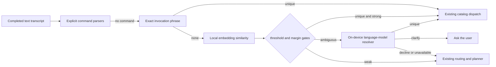

## Context

The active typed-catalog change provides one local view over bundled typed
definitions, recorded flows, skills, and Shortcuts, but intentionally supports
only explicit exact-name commands. Skill files already carry an optional
`trigger`, and teach-by-telling already uses a privacy-pinned local planner, but
the trigger is not part of transcript routing and the teaching path always
saves planner-grounded steps. Typed chat and speech recognition already enter
the same completed-transcript dispatcher, so the feature belongs after explicit
command parsers and before broad flow/planner parsing.

## Goals / Non-Goals

**Goals:**

- Keep exact triggers instant and model-free.
- Use the existing Nomic/Apple local embedding chain only as a recall aid.
- Make automatic dispatch conservative, measurable, and independently testable.
- Compile natural-language creation into fixed typed calls when every step is
  representable, otherwise retain the existing skill representation.
- Reuse all current execution policy and audit seams.

**Non-Goals:**

- Predict or execute from a partial speech hypothesis.
- Generate or execute shell, AppleScript, JXA, Lua, or arbitrary code.
- Infer parameter values the user did not state.
- Convert, inspect, or rewrite the internals of macOS Shortcuts.
- Replace recorded demonstration flows or planner-grounded skills.

## Decisions

### Route through an ordered local evidence ladder

Explicit management commands retain precedence. The new matcher then checks
normalized user-authored invocation phrases. All other requests require cosine
similarity from `PaceChainedTextEmbeddingClient`; token overlap is not execution
evidence.
Embedding input is limited to the transcript plus local candidate phrases; it
is never copied into a planner prompt. Alternatives considered were a planner
call on every turn, which adds latency and variability. Close semantic intents
such as today versus tomorrow remain blocked by the winner-margin gate.

Close candidates get one additional local-only resolution step using Apple
Foundation Models typed output. The resolver sees only the embedding shortlist
as opaque candidate identifiers plus bounded local descriptions, creates a
fresh stateless session, and must choose run, clarify, or none. It cannot
promote another catalog entry. Its identifier is validated against the supplied
candidate map before dispatch. It is never invoked for a clear winner or a
below-threshold unrelated request.

### Require both an absolute score and winner margin

An automatic semantic run requires a minimum cosine score and a minimum lead
over the second candidate. The Nomic and compact Apple NaturalLanguage vector
families use separately calibrated absolute gates because their cosine ranges
differ; the ambiguity margin remains identical. Exact trigger collisions are
ambiguous rather than resolved by source priority. The pure matcher accepts
injected vectors and thresholds so word fixtures pin each boundary. If
embeddings fail, only an exact authored alias can select an entry; all
other requests fall through.

### Put invocation evidence on catalog entries

Catalog entries expose local `invocationPhrases`. Typed definitions can provide
optional authored examples; their name and description are always included.
Skills contribute their name, description, and stored trigger. Recorded flows
and Shortcuts contribute their names because Pace cannot honestly infer hidden
semantics from those opaque or literal sources. This remains a derived catalog;
there is no vector database or duplicated persistent index.

### Add a separate user typed-definition store

User-created deterministic definitions are JSON files under Pace Application
Support, separate from read-only bundled resources and `.skill.md` files. A
write is atomic and refuses normalized-name collisions. Loads skip each invalid
file independently. The definition source distinguishes user-authored from
bundled while both retain `deterministicLocal` execution mode and the same
compiler/allowlist.

### Structure once, validate, then run without the planner

An explicit “create/teach an automation …” transcript uses the existing
privacy-pinned local planner with a constrained JSON contract containing the
definition name, invocation phrases, and typed calls. The prompt enumerates
only the deterministic allowlist and its argument guidance. The returned
definition is decoded, validated, and compiled completely before persistence.
There is no partial salvage of typed output.

If typed compilation fails, the same original description is passed to the
existing deterministic skill structurer and saved as a planner-grounded skill.
This preserves user intent without pretending the result is deterministic. A
generative model is therefore an authoring aid, never new authority.

### Test the shared transcript seam before audio

Pure matcher tests cover exact, semantic, weak, and ambiguous word fixtures.
Store and structuring tests use temporary directories and fixed planner JSON.
Dispatcher integration is kept narrow because both typed chat and finalized
voice transcription call the same transcript method. End-to-end microphone
testing is explicitly deferred until these fixtures pass.

## Risks / Trade-offs

- **Embedding score distributions differ by backend** -> Use backend-calibrated
  thresholds, require a winner margin, keep thresholds injectable, and fail open
  to the existing planner rather than to execution.
- **A broad description creates false positives** -> Weight explicit invocation
  examples above descriptions and require strong evidence for automatic runs.
- **Ambiguous embeddings miss ordinary paraphrases** -> Use a bounded on-device
  language-model resolver only for close candidates; validate its candidate ID
  and preserve clarification and fallthrough outcomes.
- **Planner emits plausible but unsupported JSON** -> Treat the typed output as
  untrusted input and require validator plus compiler success before saving.
- **Existing user skill trigger collides with a bundled phrase** -> Report an
  ambiguous matcher outcome and execute nothing automatically.
- **Catalog growth increases per-turn embedding work** -> Cache candidate
  vectors for the in-memory catalog fingerprint and embed only the transcript
  on subsequent turns; the initial implementation may batch the small catalog
  before adding cache complexity if measurement shows it unnecessary.

## Migration Plan

1. Add matcher metadata and pure text fixtures without changing explicit routes.
2. Wire completed ordinary transcripts to conservative matching and validate
   fallthrough behavior.
3. Add isolated user-definition persistence and natural-language creation.
4. Validate active OpenSpec changes, focused isolated tests, documentation, and
   diff hygiene.

Rollback removes the new pre-planner matcher and user-definition discovery.
Bundled definitions, flows, skills, and Shortcuts remain unchanged; user JSON
files can remain inert on disk without affecting older builds.
