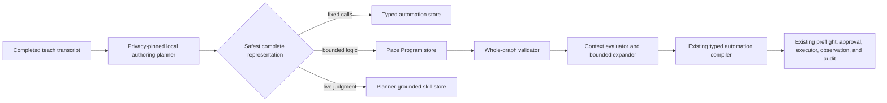

## Context

See [proposal.md](./proposal.md) for motivation and
[spec.md](./specs/programmable-teachable-skills/spec.md) for the behavior
contract. The active typed-catalog work already provides versioned tool-call
manifests, a complete compiler into `PaceActionExecutionPlan`, isolated user
storage, local catalog matching, and a shared fast-action execution seam. The
teachable-skill path already provides privacy-pinned local structuring and a
Settings surface, but its persisted steps are prose interpreted by a planner
on every run.

The missing layer must not weaken Pace's on-device boundary or create a second
action executor. JavaScriptCore alone is not a security boundary: an in-process
script can consume unbounded CPU or memory, and Hammerspoon/AppleScript/JXA
would inherit broad user-session authority. The first version therefore uses a
Pace-owned declarative intermediate representation rather than executable
source code.

## Goals / Non-Goals

**Goals:**

- Represent useful sequencing, pre-run branching, and bounded repetition.
- Make model output inert until the whole definition validates and compiles.
- Reuse the existing typed tool registry, action parser, approval, preflight,
  executor, observation, and audit paths.
- Keep program storage, context evaluation, and runs deterministic and locally
  testable.
- Let both “teach a skill” and “create an automation” choose the same safest
  representation from completed text transcripts.

**Non-Goals:**

- A general-purpose Lua or JavaScript runtime.
- Branching on the untyped result of an earlier action.
- Variables, user-defined functions, recursion, imports, timers, background
  execution, or network/file APIs.
- Generalizing a recorded Accessibility flow into a program.
- Editing a program graph manually in Settings in the first version.

## Decisions

### Persist a tagged Pace Program graph, not host-language source

Add a separate version-1 JSON definition under
`~/Library/Application Support/Pace/programs/`. Its metadata mirrors the useful
catalog fields (`identifier`, `name`, `description`, `category`, invocation
phrases, and required preferences), while its body is an ordered recursive list
of tagged nodes:

- `action`: contains one existing `PaceAutomationStep`, including its canonical
  typed tool calls.
- `condition`: contains one supported predicate plus `then` and `otherwise`
  node lists.
- `repeat`: contains a literal count and a body node list.

The Codable representation uses explicit `type` discriminators and rejects
missing, extra-for-type, or unknown payloads. This keeps persisted files
inspectable and prevents optional-field combinations from creating accidental
semantics.

Alternatives considered were raw Lua through Hammerspoon, JavaScriptCore in the
app process, and a new XPC script runner. Raw integrations grant more authority
than the generated workflow needs; JavaScriptCore cannot safely terminate all
hostile workloads in-process; an XPC runner adds packaging and protocol surface
before the product has proved that general-purpose syntax is necessary. A
future language frontend can compile into this same graph without changing run
authority.

### Limit conditions to three typed pre-run facts

Version 1 supports only:

- local weekday membership;
- local hour within a half-open range; and
- frontmost application membership by bundle identifier.

One immutable `PaceProgramContext` is captured before compilation. Predicates
cannot read arbitrary environment values, query application state, or observe
an earlier action result. Weekdays use `Calendar` weekday integers, hours use
the user's current calendar/time zone, and the frontmost app uses the bundle
identifier rather than a localized display name. Small injected context and
calendar-provider protocols keep compiler tests independent of AppKit and the
wall clock.

This is intentionally narrower than a general expression language. The three
facts cover useful “workday,” “during working hours,” and “if I am in this app”
workflows while keeping every possible data read reviewable. Requests needing
screen interpretation or action-result branching remain planner-grounded
skills.

### Validate every possible branch with fixed complexity budgets

The program validator walks the complete source graph, including branches not
selected by the current context. It enforces:

- schema version exactly `1`;
- maximum nesting depth `4`;
- maximum source-node count `50`;
- repeat counts from `1` through `10`;
- maximum worst-case expanded action steps `50`;
- valid predicate values and non-empty program metadata; and
- at least one action somewhere in the complete graph.

All action nodes across all branches are also passed through the existing typed
definition validator and compiler, using a synthetic deterministic definition.
That second pass rejects forbidden tool kinds, unknown tools, invalid argument
shapes, and partial parser consumption. Validation happens before persistence,
during discovery, and before every run. Limits are constants in the validator,
not author-controlled manifest values.

An individual condition branch may be empty. If the selected run expands to no
actions, compilation returns a typed `noActionsMatched` outcome and Pace reports
that the program's conditions did not match; it does not send an empty plan to
the executor.

### Flatten into the existing typed compiler at run time

At invocation, the compiler revalidates the stored graph, captures one context
snapshot, recursively selects condition branches, and expands literal repeats.
The flattened `PaceAutomationStep` list becomes a transient deterministic
definition and is passed to the existing automation compiler. This preserves
step grouping and ordering and ensures programmed automations cannot bypass
new safety checks added to typed actions later.

No planner session, embedding call, or script engine participates after catalog
selection. Natural-language catalog matching remains only a selector and never
interprets the program.

### Give programs their own store, catalog reference, and execution label

Add program-specific atomic storage rather than extending typed-definition or
Markdown-skill files. A malformed file is skipped independently. Saves reject
identifier and normalized-name collisions across the discovered catalog before
writing. Deletion is restricted to the program directory.

The catalog gains a program reference and a `deterministicProgram` execution
mode displayed as “deterministic program.” The source is visibly described as
a programmed automation. Dispatch resolves the stored program by identifier,
compiles it using the current context, and hands the plan to the existing fast
local action path.

The Skills view lists valid programs in “Your skills” beside taught prose
skills, with a deterministic-program badge, invocation phrase, and expanded
action budget summary. It supports deletion but not graph editing. The current
manual name/steps form continues to create planner-grounded prose skills;
program authoring is exercised through typed chat first, which already shares
the finalized-transcript seam with voice.

### Use two constrained authoring passes and one shared creation handler

The existing fixed-call structurer remains the first pass. If it cannot produce
a completely valid typed definition, a second privacy-pinned local prompt may
return either a complete Pace Program document or a decline outcome. Only the
program document is decoded; surrounding prose and source-code fences do not
become executable content. Complete validator and compiler success is required
before saving.

If both deterministic representations fail, the original description may use
the existing planner-grounded skill structurer. Both explicit creation parsers
call one shared creation handler so “teach a skill” and “create an automation”
do not develop different representation rules. The settings form remains a
deliberately explicit prose-step editor and does not call a model.

Two specialized authoring calls were chosen over a single large union prompt
because the fixed-call contract already exists and is tested. Creation is an
infrequent authoring operation, so the second call's latency is preferable to
destabilizing the simpler path. This can be collapsed later if measurements
show it matters.

### Verify pure logic before any macOS integration exercise

Focused tests use temporary directories, fixed structured-model responses, and
injected program contexts. They cover Codable round trips; all budget edges;
inactive-branch rejection; deterministic branch and repeat expansion; typed
compiler reuse; collision and invalid-file isolation; representation fallback;
catalog labels; and text dispatch. Only after these pass should the app be run
from Xcode for a manual typed-chat exercise. Terminal `xcodebuild` remains
prohibited; the isolated `scripts/test-pace.sh` path is the supported automated
test route.

## Risks / Trade-offs

- **The local model can produce valid but semantically wrong logic** → Keep
  creation separate from execution, describe the saved representation, expose
  its deterministic label, and never let validation be mistaken for intent
  verification.
- **Worst-case expansion grows recursively** → Compute the expanded count with
  overflow-safe capped arithmetic during validation and reject before building
  a large array.
- **Time or frontmost-app state changes immediately after capture** → Evaluate
  exactly once and treat the snapshot as the run's declared semantics; workflows
  needing live re-evaluation remain planner-grounded.
- **Two local authoring calls add setup latency** → Invoke the program pass only
  after fixed typing fails; no model latency is paid on subsequent runs.
- **Adding another persisted format increases catalog complexity** → Keep the
  store and compiler isolated, and extend only the catalog discovery/reference
  seams rather than the action executor.
- **Users interpret “programmed” as arbitrary-code support** → Settings and
  confirmation copy call it a bounded deterministic Pace Program and do not
  advertise Lua compatibility.

## Migration Plan

1. Add the model, validator, compiler, store, and pure tests without changing
   discovery or routing.
2. Add catalog discovery/reference/dispatch and Settings visibility.
3. Route explicit text creation through fixed → program → skill selection and
   validate transcript fixtures.
4. Update architecture, capabilities, learning, key-file, test-coverage, and
   current-status documentation after implementation is verified.
5. Run focused isolated tests, strict OpenSpec validation, documentation link
   validation, and diff hygiene; then exercise authoring and invocation from
   typed chat in an Xcode-launched app.

Rollback removes program discovery and the creation pass. Stored program JSON
may remain inert under Application Support and does not affect older builds;
typed automations, prose skills, flows, and Shortcuts require no migration.
