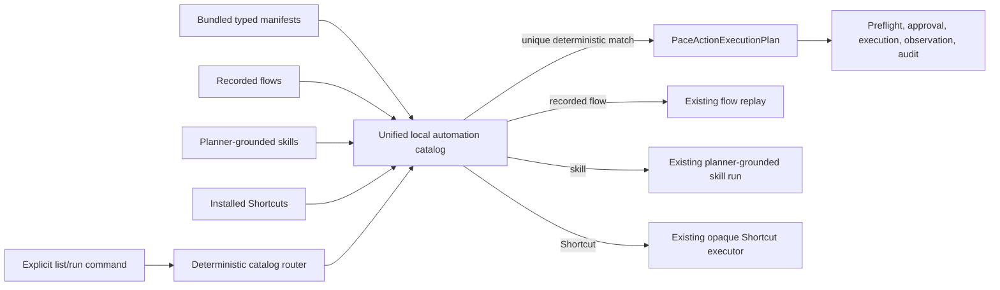

## Context

Pace currently has three reusable-work representations:

- `PaceRecordedFlow`: literal app/AX/type/key replay.
- `PaceSkillFile`: natural-language steps re-grounded by a planner.
- macOS Shortcuts: opaque external workflows invoked by name.

Bundled recipes are encoded as recorded flows even when their descriptions
imply native data access, conditional logic, or reasoning. This conflates
“repeat these keystrokes” with “achieve this outcome.” A separate typed
automation definition is needed so deterministic work can use existing native
tools directly and so the catalog can say honestly when a model remains part
of execution.

## Goals / Non-Goals

**Goals:**

- Make deterministic reusable work first-class and model-free.
- Reuse the canonical local tool and action policy rather than build a second
  executor.
- Give all reusable automation sources one read-only catalog shape.
- Label model dependence explicitly.
- Fail startup validation when a bundled automation drifts from the tool
  registry or uses a forbidden capability.
- Retire misleading recipes instead of preserving names with incomplete steps.

**Non-Goals:**

- Natural-language semantic matching against automation descriptions.
- Arbitrary shell, AppleScript, Lua, JXA, MCP, or network steps.
- Background/event triggers.
- Editing automations or creating a new Settings surface.
- Translating third-party workflow formats.
- Replacing recorded flows, planner-grounded skills, Shortcuts, cron, or
  background-agent execution with the typed manifest engine.

## Flow

## Decisions

### Separate typed automations from recorded flows

Add `PaceAutomationDefinition` rather than extending `PaceRecordedStep`.
Recorded flows are user demonstrations and must preserve their literal replay
semantics. Typed automations are authored manifests whose steps name canonical
Pace tools and JSON arguments.

Each definition includes:

- `schemaVersion`, `identifier`, `name`, `description`, and `category`.
- `source` (`bundled` in this slice).
- `executionMode` (`deterministicLocal`).
- `requiredPreferences`.
- Ordered steps, each containing one or more typed tool calls.

Tool arguments use `PaceMCPJSONValue`, which already represents bounded JSON
values without adding an untyped `Any` boundary.

### Compile manifests through the existing parser seam

The automation compiler serializes its typed calls into the existing
`<tool_calls>` shape and passes them through a narrow public
`PaceActionTagParser` entry point to obtain `PaceActionExecutionPlan`. The
compiler requires every call to parse and rejects partial plans. This keeps one
mapping from tool names/arguments to `PaceParsedAction`.

### Enforce a deterministic local allowlist

Bundled manifests may use local tools whose behavior is fully represented by
Pace's typed policy. The first allowlist excludes:

- `download_file` and MCP because they can cross the machine boundary.
- Dynamic plugins and any script surface.
- Destructive tools.
- `record_flow` and nested `run_flow` to avoid recursion.
- `shortcuts`, because an opaque external workflow cannot be claimed as a
  bundled deterministic Pace automation.

Every remaining tool keeps its normal risk classification and approval rules.
The allowlist is validated at startup alongside the tool registry.

### Make execution mode visible in the catalog model

`PaceAutomationCatalogEntry` provides a common read-only view over:

- Typed manifests: `deterministicLocal`.
- Recorded flows: `deterministicReplay`.
- Skills: `plannerGrounded`.
- Shortcuts: `externalOpaque`.

Listing copy groups or labels entries by mode so the user can tell which work
avoids a model. The catalog does not flatten all sources into one claim.

### Exact unique names only

The local router normalizes case, diacritics, and repeated whitespace. A unique
exact name match dispatches to its source-specific existing path. Zero matches
return not-found; multiple matches return a local collision response naming
the source categories. Neither case invokes a planner.

### Audit the existing bundled recipes before conversion

Each current recipe receives one disposition:

- Convert only when its description can be fulfilled entirely by allowed typed
  local actions.
- Narrow the description if the current deterministic outcome is useful but
  smaller than advertised.
- Retire when the value depends on planner judgment, a missing external app or
  Shortcut, or functionality Pace does not actually implement.

Retirements are recorded in `docs/knowledge/failed-approaches.md`; tests and
documentation must use the surviving catalog as the source of truth rather
than preserving a hard-coded count of five.

### Grow the starter library by outcome, not by mechanism

The bundled starter library may include presets built from one or more native
tools, but every entry must satisfy all of these rules:

- The name is a reusable user outcome, not a hidden implementation detail.
- The description states the complete literal result and does not imply
  reasoning, summarization, app data that is not read, or a system mode that is
  not changed.
- Fixed content is appropriate for a reusable preset, such as a note template,
  standard timer duration, known Finder folder, current-window layout, or
  bounded Calendar range.
- App-specific UI sequences remain recorded flows; contextual procedures remain
  skills; user-owned OS workflows remain Shortcuts.

The resource index remains the inventory authority. Adding an entry requires a
manifest, an index entry, successful startup compilation, and catalog coverage;
it does not add a new executor or persisted catalog database.

## Risks / Trade-offs

- **The initial catalog may be small** -> Honest, working automations are more
  useful than five impressive names with incomplete behavior.
- **Some existing recipes disappear** -> They are already misleading; the
  failed-approaches record preserves the decision and explains what would make
  them viable later.
- **Exact matching feels less magical** -> It is predictable and model-free.
  Semantic selection can be added later with a privacy-pinned local matcher.
- **Parser serialization looks indirect** -> It deliberately reuses the
  canonical action mapping and avoids a second executor/compiler hierarchy.
- **Skills still use a planner** -> The catalog labels that fact instead of
  pretending every automation is deterministic.

## Migration Plan

1. Add the definition, catalog-entry, validator, and compiler models with pure
   tests.
2. Audit all five bundled recipes and document convert/narrow/retire decisions.
3. Add surviving typed manifests and remove retired recipe artifacts through
   the normal patch workflow.
4. Add unified discovery and exact list/run routing over manifests, flows,
   skills, and Shortcuts.
5. Update startup validation and canonical docs.
6. Run focused tests through `scripts/test-pace.sh`, OpenSpec strict validation,
   docs validation, and `git diff --check`.
7. Expand the validated manifests into the starter library without changing
   the execution boundaries of flows, skills, Shortcuts, or schedulers.

Rollback restores the recipe artifacts and removes the catalog branch. No user
flow, skill, or Shortcut data is modified.
