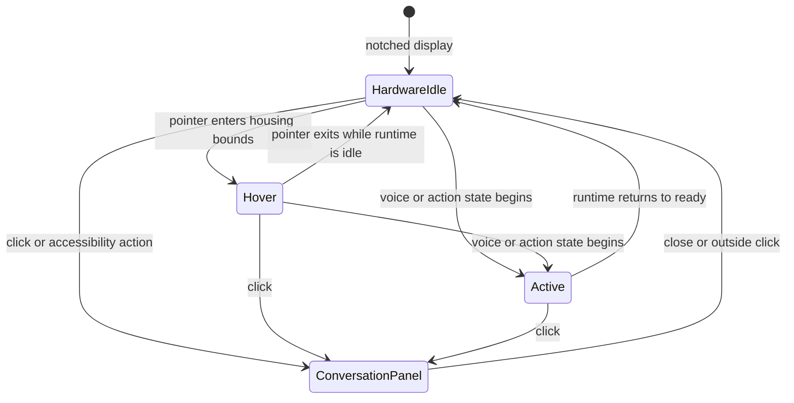

## Context

See [proposal.md](./proposal.md), the
[native-interface-system spec](./specs/native-interface-system/spec.md), the
[first-command-onboarding spec](./specs/first-command-onboarding/spec.md), and
the native design authority at `leanring-buddy/DESIGN.md`.

Pace already owns nearly every behavioral seam the overhaul needs:

- `PacePermissionService` publishes live permission state.
- `PaceOnboardingWindowManager` gates first launch through UserDefaults.
- `CompanionManager.submitChatTranscriptFromDeepLink` reaches the same
  finalized text path used by ordinary typed input.
- `PacePanelChatView` renders the shipped panel conversation and tool outcomes.
- `PaceMenuBarOverlayView` owns the persistent notch signal.
- `PaceMainWindowManager` and `PaceSettingsWindowManager` currently host two
  separate management shells.

The implementation should reshape these seams instead of creating a demo-only
runtime. The cinematic visuals remain code-native SwiftUI shapes and standard
materials; generated comps are direction evidence, not raster UI assets.

## Goals / Non-Goals

**Goals:**

- Reach one real user-submitted request during onboarding.
- Make local and off-device state unmistakable across all native surfaces.
- Create a memorable full-window-to-notch handoff without pretending SwiftUI
  can share geometry across independent NSWindows.
- Give the quick panel a clear present-turn hierarchy.
- Replace parallel main/settings navigation with one grouped Command Center.
- Keep state and animation policies pure enough for fast isolated tests.

**Non-Goals:**

- Rewriting planner, speech, action, permission, conversation, or audit logic.
- Adding a scene engine, Lottie, Rive, Metal renderer, or other dependency.
- Playing sound or TTS automatically during first launch.
- Changing the public website design.
- Requiring onboarding completion before the user can access Pace.
- Claiming that every natural-language request will produce an action.

## Decisions

### Model onboarding as an explicit versioned state machine

Introduce a pure `PaceOnboardingStateModel` with versioned persistence and
these stages: `ignition`, `permissions`, `firstCommand`, `handoff`, and
`complete`. It owns progression, resumability, skip behavior, and derived
presentation state; it does not request permissions or execute commands.

The view observes `PacePermissionService` and the existing companion state,
then sends events into the model. Completion stores an integer onboarding
version rather than only a Boolean. The legacy Boolean is read as version 1 so
existing users do not re-enter first run.

Delayed auto-advance work is stored in a cancellable `Task`. Stage changes and
window teardown cancel it so a stale grant animation cannot skip a later page.

### Use one shared semantic signal model across surfaces

Add a pure mapping from production state to a small UI vocabulary:

- `ready`
- `listening`
- `understanding`
- `awaitingApproval`
- `acting`
- `speaking`
- `completed`
- `blocked`
- `failed`

Each value produces a plain-language label, accessibility value, color role,
and motion policy. Off-device activity is an orthogonal boundary flag that
overrides the active signal role to amber. SwiftUI views consume roles rather
than open-coding colors for the same state.

The waveform itself remains a reusable code-native shape. Audio power may
drive its amplitude only while listening; other stages use deterministic line
travel or aperture changes keyed to real state.

### Make the first command a production request, not a tutorial simulation

The first-command scene provides an editable suggestion, initially “Open Notes
and start a weekly plan.” Pressing Try It calls the same companion submission
method as typed chat. The scene observes production chat, stream, action result,
approval, readiness, and error state to determine what happened.

No onboarding-specific command parser or executor is added. A response without
an action is still valid first value and receives different copy from a
completed action. Missing permission, model, preference, or action enablement
uses the existing failure/preflight result and does not fabricate completion.

### Simulate the handoff inside the onboarding window, then reveal the real notch

SwiftUI matched geometry cannot cross independent AppKit windows reliably. The
handoff therefore uses the shared notch silhouette and signal shape inside the
onboarding window: the working composition contracts into a top-center anchor,
then the window closes and the already-running real menu-bar overlay becomes
visible. The quick panel may open afterward if it does not steal focus from a
still-running action.

Under Reduce Motion, the stage crossfades, the window closes, and the real notch
appears without travel or scale.

### Consolidate management through one destination router

Create a public `PaceCommandCenterDestination` enum grouped into Work, Observe,
and Configure. `PaceMainWindowManager.show` accepts a destination. Existing
main-window views and settings-tab views are reused as detail content while the
shell is replaced.

`PaceSettingsWindowManager` becomes a compatibility facade that routes to the
Command Center's requested settings destination. It no longer owns a second
window. Existing call sites can migrate incrementally without changing their
user-visible behavior.

The last valid destination is stored locally. Private/debug destinations remain
available but appear in a lower-emphasis Diagnostics group rather than beside
everyday settings.

```mermaid
flowchart LR
    Launch[First launch] --> State[Versioned onboarding state]
    State --> Ignite[Ignition scene]
    Ignite --> Permissions[Live permission channels]
    Permissions --> First[Editable first command]
    First --> Transcript[Existing finalized transcript path]
    Transcript --> Runtime[Planner, approval, executor, observation]
    Runtime -->|real result| Handoff[Signal contracts to notch anchor]
    Handoff --> Notch[Real menu-bar signal]
    Notch --> Panel[Present-turn quick panel]
    Panel --> Center[Grouped Command Center]
```

### Keep animation code-native and centrally governed

Extend `DesignSystem.swift` with native surface tokens and add shared motion
constants/policies. Use `Canvas`, `Shape`, `TimelineView`, standard SwiftUI
transitions, `matchedGeometryEffect` within one window, and existing AppKit
hosting. No production dependency is necessary.

Views must derive animation enablement from `accessibilityReduceMotion`. Long
onboarding motion has explicit completion callbacks and cancellation; daily
operating surfaces avoid continuous animation except audio-reactive listening
feedback.

### Derive the Living Notch from the physical camera housing

The closed notch is not a branded capsule. On a notched display, derive its
global rectangle from `NSScreen.auxiliaryTopLeftArea`,
`NSScreen.auxiliaryTopRightArea`, and `safeAreaInsets.top`. The idle overlay
matches that physical width and height exactly and draws no Pace ornament.

Hover adds compact horizontal wings to the measured housing. Listening,
understanding, approval, acting, speaking, blocked, and failure states use
slightly wider wings: the state label sits beside the housing's left edge and
the signal sits beside its right edge, so the center remains visually quiet.
Clicking extends those wings equally left and right to the quick-panel width,
then the same `PaceMenuBarOverlayPanel` grows downward and reveals the embedded
conversation view. This deliberately follows the proven single-surface
interaction model used by Boring Notch rather than trying to disguise two
AppKit windows as one. `MenuBarPanelManager` routes normal panel requests into
the integrated surface on supported notched displays while retaining its
standalone fallback. Closing or outside-click dismissal restores the correct
hardware, hover, or runtime silhouette.

The manager recalculates after display-parameter changes and wake. When the
current display has no camera housing, Pace does not synthesize a fake notch;
the global shortcut remains the reliable entry point. Reduce Motion replaces
frame interpolation with an immediate resize and content crossfade.

### Verify pure state before Xcode-only visual and hardware checks

Unit tests cover onboarding migration and progression, cancellation-safe state,
signal mapping, boundary color roles, Reduce Motion policy, Command Center
grouping/routing, and first-command outcome classification. Run them through
`scripts/test-pace.sh`, then the full isolated suite.

Visual and hardware verification must run from Xcode to preserve TCC. Exercise
fresh install, partial permission setup, skip/resume, typed first command,
voice first command, reduced motion, VoiceOver focus order, off-device amber,
and existing-user startup. Capture native screenshots at the window and panel
sizes that materially apply; the web-only 390/768/1440 receipt fields will be
filled with representative native viewport captures and documented as such.

## Risks / Trade-offs

- **Cinematic work delays first value** → Controls are available immediately;
  the core scene is short, skippable, and the selected composition centers the
  actual first command.
- **Generated concept art suggests impossible cross-window morphing** → Simulate
  the collapse within onboarding, reuse the same signal shape, then reveal the
  real overlay; do not attempt unsupported shared geometry across NSWindows.
- **First suggested action may be unavailable** → Keep the text editable, use
  production preflight, and accept a truthful non-action response as first
  value.
- **Merging windows destabilizes many call sites** → Preserve
  `PaceSettingsWindowManager` as a routing facade until callers are migrated and
  tested.
- **Animation consumes CPU in an always-on app** → Limit timeline-driven work to
  listening or visible onboarding, stop it when hidden, and test state teardown.
- **Notch chrome covers menu extras or drifts after wake** → Use the hardware
  safe-area gap as the only horizontal authority, keep active expansion
  vertical, and recompute after display and wake notifications.
- **The overhaul obscures expert controls** → Group and search destinations;
  preserve every existing setting and debug surface during the shell migration.

## Migration Plan

1. Land the native design authority, shared state/motion models, and pure tests.
2. Replace onboarding while retaining legacy completion migration.
3. Apply the shared signal and present-turn hierarchy to the shipped notch and
   panel.
4. Route both management entry points into the grouped Command Center and
   migrate existing destinations without deleting their content views.
5. Run focused and full isolated tests, then exercise visual/hardware behavior
   from Xcode. Update durable status only after those checks.

Rollback can restore the old onboarding and window hosts while leaving the new
versioned completion value and pure UI models inert. No user automation,
conversation, permission, or planner data changes format.
